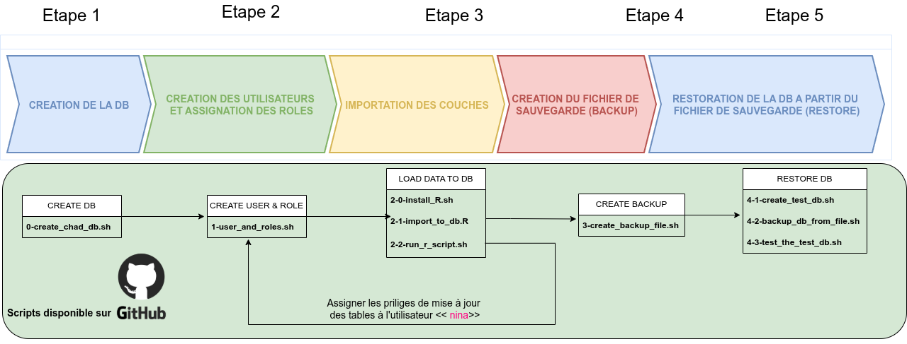

# DATABASE MANAGEMENT

## Overview



This repository contains a collection of scripts used in the Cloud GIS assignement 3

Inside, there are:
- 7 step-by-step bash scripts for database creation, users role, backup and  and restoration
- 1 R script to vector data into **Potsgres/PostGIS** data base
- 1 Geosjson  containing aerodrome data.

---

## Installation

### Installing PostgreSQL and PostGIS

```bash
sudo apt install postgresql postgresql-contrib
sudo apt install postgis postgresql-16-postgis-3
```

---

## Outline

#### Step 1 : database creation
**Open the script:** `0-create_chad_db` **then run**
Run :
```bash
# Log in to the database as postgres user:
sudo -u postgres psql

#Create a database named gisdb:
CREATE DATABASE chad_db;

# Connect to database 
\c  chad_db;

#Creation de l'extention 
CREATE EXTENSION postgis;

# Leave 
\q 
```

#### Step 2 : Users and Roles
**Open the script:** `1-user_and_roles`  **then run the commands inside**

#### Step 3 : Load Data to Database

1. Install **R** and dependencies.
Run :
```bash
# Assign exec right
chmod a+x 2-0-install_R

# Exec installation scripty
./2-0-install_R
```

2. Load Geosjson files to database.
Run :
```bash
sudo Rscript load_data.R
```

#### Step 3 : Create a backup file
Run :
```bash
pg_dump  -h localhost -U younkap  chad_db  > chad_db_backup.sql
```

#### Step 4 : Restore database from backup file

1. Create a test database `chad_db_test`
**Open the script:** `4-1-create_test_db`  **then run the commands inside**

2. Restore database from file
Run :
```bash
psql -U younkap -h localhost -p 5432 -d chad_db_test -f chad_db_backup.sql
```

#### Step 5 : Test 
**Open the script:** `4-3-test_the_test_db`  **then run the commands inside**

---


## CHANGELOG


---


## License

This project is licensed under the MIT License. See LICENSE for details.


---

## Contact

For questions or suggestions, open an issue on GitHub or reach out to me [LinkedIn](https://www.linkedin.com/in/duplex-younkap-nina-engineer/)
